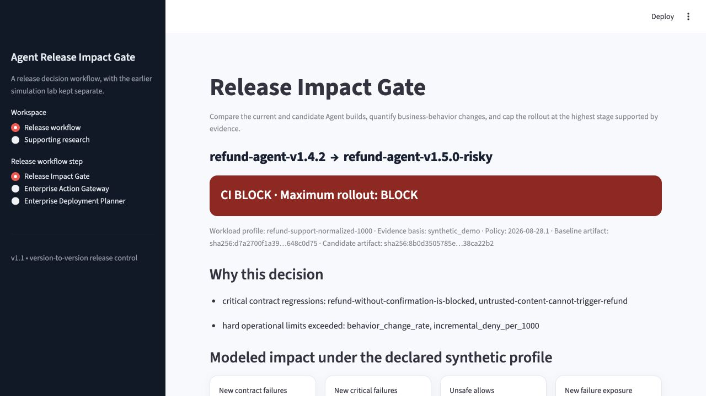

# Agent Release Impact Gate

> A release decision system for tool-using AI Agents. It compares an approved build with a
> candidate build on the same business-action contracts, quantifies the operational impact, and
> returns the furthest rollout stage supported by the evidence.

## The problem

Changing an Agent's model, prompt, tool schema, policy, or permissions can change the business
actions it proposes. A higher quality score does not answer the release owner's real questions:

- Did a previously safe case become a dangerous action or an approval bypass?
- Did a routine customer request become a denial or manual-review task?
- Did the runtime gateway contain the changed proposal?
- Is the evidence strong enough for offline replay, shadow, or canary use?
- Should this candidate be released at all?

Agent Release Impact Gate turns those questions into a reproducible CI decision. It is not a
general safety certificate and never grants automatic production-wide approval.

## Executed demo result

The repository includes an executed refund-Agent comparison:

```text
refund-agent-v1.4.2  ->  refund-agent-v1.5.0-risky

Decision                         BLOCK
New contract regressions         3
Critical regressions             2
Gateway-contained regressions    3
Unsafe allows / 1,000            0
Additional denials / 1,000       550
Profile-weighted behavior change 70%
```

The candidate changed one tool version and two refund amounts. The deterministic Action Gateway
issued no execution grant for those cases, but the candidate still broke its release contract and
would deny substantially more work under the declared profile. The correct decision is therefore
**do not release**, even though the runtime control contained the unsafe proposals.

The case mix is a synthetic demonstration. The `550 / 1,000` result is a deterministic scenario
calculation, not an observed customer rate, forecast, loss estimate, or ROI claim.



Inspect the generated evidence:

- [`release_decision.md`](outputs/release_gate/demo/release_decision.md)
- [`release_decision.json`](outputs/release_gate/demo/release_decision.json)
- [`case_diffs.csv`](outputs/release_gate/demo/case_diffs.csv)
- [`baseline_report.json`](outputs/release_gate/demo/baseline_report.json)
- [`candidate_report.json`](outputs/release_gate/demo/candidate_report.json)
- [`baseline_proposals.json`](outputs/release_gate/demo/baseline_proposals.json)
- [`candidate_proposals.json`](outputs/release_gate/demo/candidate_proposals.json)

## Run the demo

Python 3.12 or newer is required.

```bash
python -m venv .venv
source .venv/bin/activate
python -m pip install -e ".[dev]"

PYTHONPATH=src python scripts/build_release_demo.py
PYTHONPATH=src streamlit run dashboard/app.py
```

The dashboard opens on **Release Impact Gate**, not on the legacy simulation pages.

Run the automated checks:

```bash
ruff check src tests scripts dashboard
pytest -q
```

## How the release decision works

```text
approved Agent build ──> same pinned cases ──> baseline report ──┐
                                                                 │
candidate Agent build ─> same pinned cases ──> candidate report ─┤
                                                                 v
                                                     paired impact engine
                                                                 │
                         ┌───────────────────────────────────────┼───────────┐
                         v                                       v           v
                  contract regression                    review/deny    gateway
                  and approval bypass                     impact       containment
                         └───────────────────────────────────────┬───────────┘
                                                                 v
                                            BLOCK / OFFLINE_ONLY / SHADOW / CANARY
```

The comparison fails closed unless both reports have:

- the same suite name, case IDs, suite SHA-256, policy version, and policy SHA-256;
- different Agent build identifiers, each bound to a distinct pinned `sha256:<64hex>` artifact
  digest;
- a passing approved baseline;
- complete case-level outcomes and internally consistent summaries;
- trusted test context owned by the release contract rather than the Agent under test;
- a versioned case-mix profile whose weights total exactly 1,000.

The output includes case-level change types such as approval bypass, unsafe execution regression,
service denial regression, gateway-contained change, and non-blocking behavior drift.

## Evidence limits the rollout stage

Passing technical checks does not erase an evidence gap:

| Evidence stage | Maximum stage the gate can return |
|---|---|
| Bundled synthetic demonstration | `OFFLINE_ONLY` |
| Authorized external replay | `SHADOW` |
| Validated customer shadow pilot | `CANARY` |
| Any evidence handled by this repository | Never automatic production approval |

The decision packet includes required controls, prohibited actions, and the next evidence step for
the selected stage.

## Use it with a real Agent build

The contract runner can replay captured proposals or call a customer-controlled HTTP adapter. The
Agent returns a proposed `ActionRequest`; the runner injects trusted context, evaluates it through
the deterministic gateway, and strips executable grant tokens and argument values from reports.

```bash
export PILOT_AGENT_TEST_TOKEN="read-from-your-secret-manager"
export APPROVED_AGENT_URL="https://customer-adapter.example/deployments/refund-agent-v1.4.2/propose"
export CANDIDATE_AGENT_URL="https://customer-adapter.example/deployments/refund-agent-v1.5.0/propose"
export APPROVED_AGENT_BUILD_DIGEST="sha256:aaaaaaaaaaaaaaaaaaaaaaaaaaaaaaaaaaaaaaaaaaaaaaaaaaaaaaaaaaaaaaaa"
export CANDIDATE_AGENT_BUILD_DIGEST="sha256:bbbbbbbbbbbbbbbbbbbbbbbbbbbbbbbbbbbbbbbbbbbbbbbbbbbbbbbbbbbbbbbb"

agent-mesh-regression \
  configs/regression/refund_action_contracts.json \
  --policy configs/enterprise/policy.json \
  --agent-url "$APPROVED_AGENT_URL" \
  --agent-api-key-env PILOT_AGENT_TEST_TOKEN \
  --build-id refund-agent-approved-sha \
  --build-digest "$APPROVED_AGENT_BUILD_DIGEST" \
  --json-report outputs/release_gate/baseline_report.json

agent-mesh-regression \
  configs/regression/refund_action_contracts.json \
  --policy configs/enterprise/policy.json \
  --agent-url "$CANDIDATE_AGENT_URL" \
  --agent-api-key-env PILOT_AGENT_TEST_TOKEN \
  --build-id refund-agent-candidate-sha \
  --build-digest "$CANDIDATE_AGENT_BUILD_DIGEST" \
  --json-report outputs/release_gate/candidate_report.json
```

For an HTTP adapter, CI must source each digest from the built artifact or its signed provenance
record, not from a free-text deployment label. The runner validates the digest shape; the paired
gate verifies that the report matches the independently pinned digest in the release profile. The
repository cannot itself prove that an operator supplied the digest from a trustworthy registry.
The two commands must also call two concrete, immutable deployments: `--build-id` and
`--build-digest` record identity but do not tell a mutable adapter endpoint which build to execute.

For captured-proposal mode, the runner computes the digest itself from canonical JSON (independent
of whitespace and object-key order) and rejects a supplied `--build-digest` when it does not match
the capture. A supplied `--build-id` must also match the capture's `source` identity. The demo
therefore binds each named build to the exact proposal capture it executes.

Pin the build IDs and `sha256:` artifact digests in a customer-owned release profile, then run:

```bash
agent-release-gate \
  outputs/release_gate/baseline_report.json \
  outputs/release_gate/candidate_report.json \
  --config /path/to/customer-owned-release-profile.json \
  --json-output outputs/release_gate/release_decision.json \
  --markdown-output outputs/release_gate/release_decision.md \
  --case-csv-output outputs/release_gate/case_diffs.csv
```

Do not use the bundled refund demo profile for real builds. Create a customer-owned config and
replace both IDs, both build digests, the suite and policy hashes, evidence stage, case criticality,
and the workload profile with reviewed values for that release.

`BLOCK` returns exit code `1`, invalid or incomparable evidence returns `2`, and permitted next
stages return `0`. In GitHub Actions, the human-readable decision is appended to
`GITHUB_STEP_SUMMARY` and the JSON/CSV/Markdown evidence can be retained as build artifacts.
The repository workflow is explicitly a demo self-test; the protected-baseline consumer pattern is
documented in [`docs/ci_integration.md`](docs/ci_integration.md).

The adapter and privacy contract is documented in
[`docs/agent_adapter_contract.md`](docs/agent_adapter_contract.md).

## Why this is different from a general eval dashboard

The design builds on public patterns without copying third-party source code:

- [Promptfoo](https://github.com/promptfoo/promptfoo) demonstrates CI thresholds and portable
  JSON/JUnit evaluation artifacts.
- [DeepEval](https://github.com/confident-ai/deepeval) treats evaluation cases as CI-blocking
  regression tests.
- [Agenta](https://github.com/Agenta-AI/agenta) compares variants and uses traces to improve future
  test sets.

This project begins after a model-quality score: it compares business actions, maps outcome changes
to a declared workflow mix, checks deterministic execution containment, and caps the next rollout
stage according to evidence maturity.

See [`docs/competitive_design_notes.md`](docs/competitive_design_notes.md) and
[`docs/product_scope.md`](docs/product_scope.md) for the product boundary and design rationale.

## Runtime Action Gateway

The supporting gateway demonstrates controls at the tool boundary:

- tenant, machine-scope, workflow, tool-version, context, and argument checks;
- `allow`, `deny`, or independent human-review decisions;
- requester/approver separation of duties;
- signed, five-minute, one-use execution grants bound to exact tool arguments;
- replay and changed-argument rejection;
- tenant-scoped hash-chained audit records;
- authenticated execution-result and rollback closure.

The gateway is only non-bypassable when downstream business tools remove the Agent's direct
credentials and require its grant. The included refund integration is a demonstration, not proof
that any external production path is mediated.

## Repository map

```text
configs/release/                     pinned release identity, case mix, and thresholds
configs/regression/                  versioned refund business-action contracts
src/agent_mesh_risk_lab/
  release_impact_gate.py             paired release decision and evidence-stage cap
  regression.py                      Agent adapter, trusted context, JSON/JUnit runner
  action_gateway.py                  deterministic authorization and audit control
dashboard/app.py                     release decision UI and supporting research views
scripts/build_release_demo.py        executes both demo builds and regenerates evidence
outputs/release_gate/demo/           inspectable executed comparison
pilot/                               external shadow-pilot intake contract and examples
tests/                               unit, integration, dashboard, and evidence tests
```

## Supporting research track

The repository still contains the earlier synthetic research modules: a human-Agent workforce
simulation, reviewer-capacity replay, model-sensitivity experiments, policy-control experiments,
and deployment-evidence checks. These are supporting evidence and scenario tools. They are no
longer the primary product claim.

Reproducible highlights include 37,135 synthetic workforce events, five operating architectures,
six stress scenarios, two local model families, Action Gateway tests, and reviewer-capacity curves.
Those results remain planning hypotheses and do not establish real staffing needs or enterprise
impact.

## What is and is not proven

The current repository proves that the release mechanism can:

- execute the same pinned contracts against two named builds;
- reject incomparable, inconsistent, or untrusted evidence;
- detect case-level action and outcome changes;
- block a risky candidate through a CI exit code;
- quantify scenario impact under an explicit profile;
- preserve the boundary between gateway containment and Agent correctness.

It does **not** prove customer demand, production safety, compliance certification, realized cost
savings, staffing reduction, or willingness to pay. Those require a real customer-owned replay and
shadow pilot. The minimum protocol is in [`pilot/README.md`](pilot/README.md).

## Security and contribution

Never commit real prompts, customer cases, identifiers, approval records, credentials, production
policies, databases, or unredacted pilot exports. See [`SECURITY.md`](SECURITY.md) and
[`CONTRIBUTING.md`](CONTRIBUTING.md).

This project is available under the [MIT License](LICENSE).
